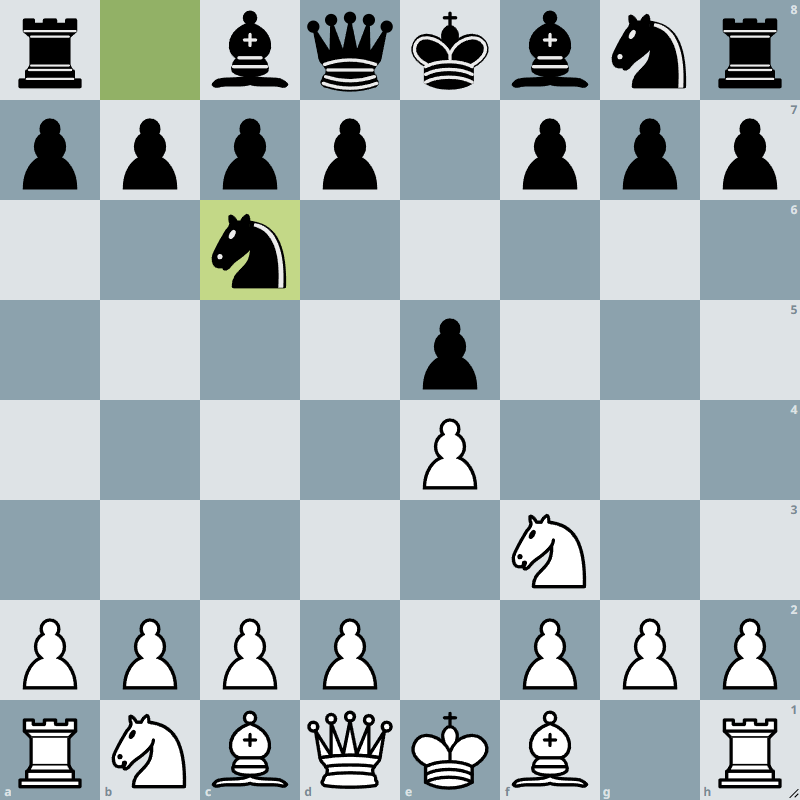

# Data sources

## Chess game notations

Chess positions can be stored in one of two formats: **PGN**s or **FEN**s. PGN (Portable Game Format) is often used when people write down moves from the start of the game. PGN can also include data such as event names, players, ELO, and results. FEN (Forsyth-Edwards Notation) is a simplified shorter notation that can describe one position. FEN has the disadvantage of not being able to encode data outside of chess positions such as move order, player names, ELO, and results. In this project, we will be following chess games from the start of the game thus will be using the PGN format as the base format.

The following encode the same chess game or chess position.

### Image of the position

### - Sample PGN

[Event "EDAV chess tournament"]

[Site "Columbia University, NYC"]

[Date "December 1st"]

[Round "1"]

[White "student A"]

[Black "student B"]

[Result "1-0"]

1. e4 1...e5 2.Nf3 2...Nc6 1-0

### - Sample FEN

r1bqkbnr/pppp1ppp/2n5/4p3/4P3/5N2/PPPP1PPP/RNBQKB1R w KQkq - 2 3

## Choosing the right data

There are many online data sets that include chess PGN.
For instance, CRAN Project [RChess](https://cran.r-project.org/web/packages/rchess/index.html) has its data set **chesswc** which is a collection of chess games from the FIDE World Cup 2011, 2013, and 2015.

However, for the purpose of our project, there were a specific set of requirements that had to be sufficed:

1. Sufficient **amount** of chess games

2. **Evaluation** of every move

3. **Clock** after every move

The First requirement is relatively simple to achieve. However, very few chess data sets include computer evaluation and clock time in their PGNs. The second and third requirements are not part of the original PGN notation making it the limiting factor for our choice of data set.

We decided to use the data from [lichess database](https://database.lichess.org/). The project decided to use the October 2021 games that included 88,092,721	games played online in lichess.org. Some of the games in the database encoded evaluation and clock time after every move.

## Lichess Game Data Format

**lichess_db_standard_rated_2021-10.pgn**

Total 88,092,721 games.

The file can be downloaded from [database.lichess.org](https://database.lichess.org/).
The file is a list of PGNs without an index.
All of the following data sets are results of organizing this data.
Not all games from the database are guaranteed to have [%clk] or [%eval] which are the clock time and the evaluation of the position. According to the Lichess database, around 6% of the games are annotated with evaluation. 
The following is a sample PGN format Lichess uses.

---

[Event "Rated Bullet game"]

[Site "https://lichess.org/NRafdioG"]

[Date "2021.10.01"]

[Round "-"]

[White "xtzdavi182"]

[Black "al_fatih"]

[Result "1-0"]

[UTCDate "2021.10.01"]

[UTCTime "00:00:14"]

[WhiteElo "1703"]

[BlackElo "1698"]

[WhiteRatingDiff "+6"]

[BlackRatingDiff "-6"]

[ECO "B50"]

[Opening "Sicilian Defense: Modern Variations"]

[TimeControl "60+0"]

[Termination "Time forfeit"]

1. e4 { [%clk 0:01:00] } 1... c5 { [%clk 0:01:00] } 2. Nf3 { [%clk 0:01:00] } 2... d6 { [%clk 0:00:59] } 3. b3 { [%clk 0:01:00] } 3... Nc6 { [%clk 0:00:58] } 4. Bb2 { [%clk 0:01:00] } 4... Nf6 { [%clk 0:00:58] } 5. Bb5 { [%clk 0:00:59] } 5... Bd7 { [%clk 0:00:56] } 6. O-O { [%clk 0:00:59] } 6... a6 { [%clk 0:00:55] } 7. Bxc6 { [%clk 0:00:58] } 7... Bxc6 { [%clk 0:00:55] } 8. Re1 { [%clk 0:00:58] } 8... g6 { [%clk 0:00:55] } 9. h3 { [%clk 0:00:58] } 9... Bg7 { [%clk 0:00:54] } 10. d3 { [%clk 0:00:57] } 10... O-O { [%clk 0:00:53] } 11. Nbd2 { [%clk 0:00:57] } 11... b5 { [%clk 0:00:51] } 12. Rb1 { [%clk 0:00:57] } 12... Re8 { [%clk 0:00:51] } 13. c4 { [%clk 0:00:57] } 13... b4 { [%clk 0:00:49] } 14. a3 { [%clk 0:00:56] } 14... a5 { [%clk 0:00:47] } 15. axb4 { [%clk 0:00:55] } 15... cxb4 { [%clk 0:00:47] } 16. Ra1 { [%clk 0:00:55] } 16... Qb6 { [%clk 0:00:45] } 17. Bd4 { [%clk 0:00:53] } 17... Qc7 { [%clk 0:00:43] } 18. e5 { [%clk 0:00:51] } 18... dxe5 { [%clk 0:00:42] } 19. Nxe5 { [%clk 0:00:51] } 19... Bb7 { [%clk 0:00:39] } 20. Qc2 { [%clk 0:00:44] } 20... Rad8 { [%clk 0:00:38] } 21. Be3 { [%clk 0:00:42] } 21... Nd5 { [%clk 0:00:31] } 22. Nef3 { [%clk 0:00:40] } 22... Nxe3 { [%clk 0:00:29] } 23. Rxe3 { [%clk 0:00:40] } 23... Qd6 { [%clk 0:00:25] } 24. Rae1 { [%clk 0:00:39] } 24... e6 { [%clk 0:00:23] } 25. d4 { [%clk 0:00:38] } 25... Bxf3 { [%clk 0:00:18] } 26. Nxf3 { [%clk 0:00:37] } 26... Rc8 { [%clk 0:00:14] } 27. c5 { [%clk 0:00:34] } 27... Qd5 { [%clk 0:00:11] } 28. Rd3 { [%clk 0:00:32] } 28... Red8 { [%clk 0:00:10] } 29. Re5 { [%clk 0:00:31] } 29... Qc6 { [%clk 0:00:07] } 30. Ree3 { [%clk 0:00:29] } 30... Qb5 { [%clk 0:00:06] } 31. Qe2 { [%clk 0:00:27] } 31... Rc7 { [%clk 0:00:04] } 32. Rxe6 { [%clk 0:00:26] } 32... fxe6 { [%clk 0:00:03] } 33. Qxe6+ { [%clk 0:00:26] } 1-0

---

## Missing Data

**data_index.csv** index from **1 - 9**

10,000,000 lines per csv. Total 88,092,721 lines.

The data_index.csv was created to understand which data was missing in the original data.
The columns of the data were constructed as follows.

| Column Name | Description |
| --- | ----------- |
| Result | Result of the game (chr) ex) 1-0 |
| UTCDate | UTC date of the game (chr) ex) 2021.10.01 |
| UTCTime | UTC time of the game (num) ex) 00:00:14 |
| WhiteElo | White player's Elo in Lichess (num) |
| BlackElo | Black player's Elo in Lichess (num) |
| WhiteRatingDiff | Change in White player's Elo after the game (num)|
| BlackRatingDiff |Change in Black player's Elo after the game (num) |
| ECO | Encyclopedia of Chess Openings. The Opening that was played in the game (chr) ex) B50 |
| TimeControl | The time format in which the game was played. (chr) ex) 10 minutes + 5 second increment = "600+5" |
| Termination | How the game ended (chr) ex) Normal(checkmate or resignation), Abandoned(players left the game), Time Forfeit (players ran out of time) |
| Evaluation | Whether or not the game was annotated (chr) ex) Yes, No |

## Moves Data

**moves_index.csv** index from **1 - 93**

5,000,000 lines per csv. Total 464,436,334 lines.

The moves_index.csv was created to format the data move by move.
The columns of the data were constructed as follows.

| Column Name | Description |
| --- | ----------- |
| Result | Result of the game (chr) ex) 1-0|
| WhiteElo | White player's Elo in Lichess (num)|
| BlackElo | Black player's Elo in Lichess (num)|
| ECO | Encyclopedia of Chess Openings. The Opening that was played in the game (chr) ex) B50 |
| TimeControl | The time format in which the game was played. (chr) ex) 10 minutes + 5 second increment = "600+5" |
| Termination | How the game ended (chr) ex) Normal(checkmate or resignation), Abandoned(players left the game), Time Forfeit (players ran out of time) |
| Color | The color of the player that made the move (chr) ex) w or b |
| MoveNum | The number of the move (num) |
| Move | The algebraic notation of the move made (chr) ex) Qh4 |
| Type | One of the seven types of move: blunder, mistake, dubious, normal, interesting, good, and brilliant (chr)|
| Eval | Computer evaluation after the move (chr) ex) 0.07 or #2(mate in 2 for white)|
| EvalDiff | The change in evaluation. It is 0 when the previous or current evaluation was forced mate (#number) (num)|
| Time | Time left for the player (num) ex) 0:01:50 |
| TimeSpent | Time spent on the move (num) ex) 0:00:02 |

## 600+0 Data

**600+0_index.csv** index from **1 - 16**
5,000,000 lines per csv. Total 78,867,621 lines.

The 600+0_index.csv was created to work with a manageable size of data.
The columns of the data were identical to moves_index.csv.
