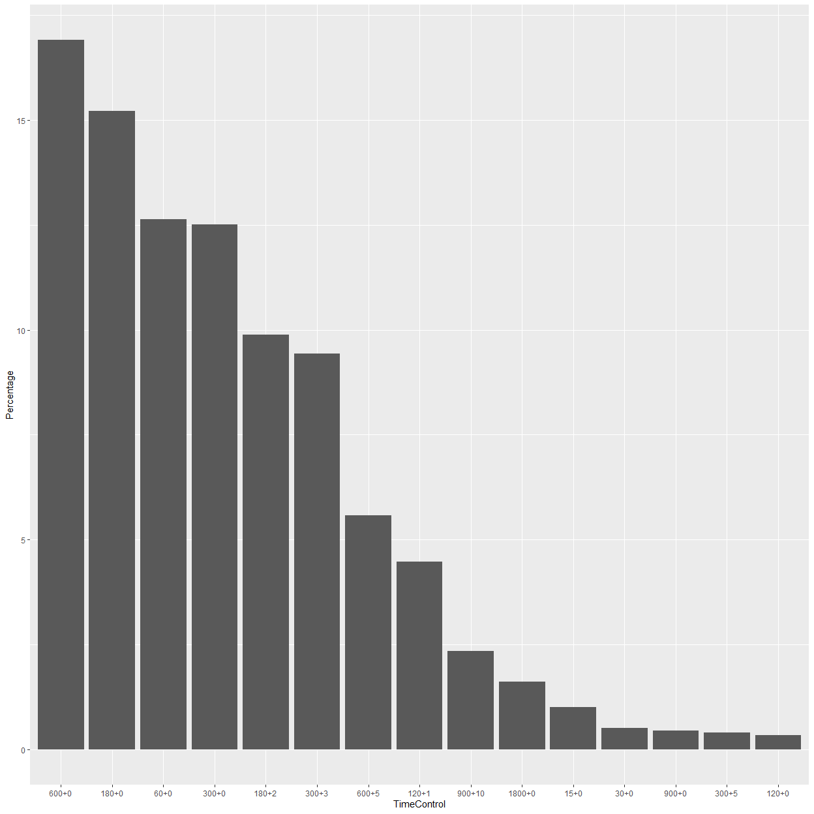

# Data transformation

## Understanding the Raw Data

The raw data was in a zipped format of .pgn.bz2. The unzipped .pgn file was then converted through [read.py](https://github.com/ww2615/chessgame_analysis/blob/main/code/read.py).

The result of this transformation was named "data_index.csv" each constituting of 10,000,000 lines. Naturally, there were 9 files since the total count of games in the original data was 88,092,721.

This "data_index.csv" was only generated to answer the following questions.

- What items are missing in the original data?
- How much games were annotated?

The answer to the first question will be answered in the next chapter.
From the data, we deduced that 7,142,630 / 88,092,721 = **8.1 %** of the games were annotated compared to the **6 %** claimed on the [website](https://database.lichess.org/#standard_games).

## Formatting the Raw Data

We decided to focus on the **7,142,630** games that were annotated.

The first formatting process was done using [eval.py](https://github.com/ww2615/chessgame_analysis/blob/main/code/eval.py).

This process was different from the read.py that the resulting csv(pgn_index.csv) from eval.py contained the PGN descriptions of every game played.

This process was conducted to generate a working **csv dataset** independent from the original dataset.

The second formatting process used [edit.py](https://github.com/ww2615/chessgame_analysis/blob/main/code/edit.py).

The formatting process intended to change **each row** to **moves** instead of **games**.

The missing data of this csv data set will be examined in the next chapter.

464,436,334 annotated moves have been played but this dataset was impossible to work with. 

We decided to focus on the most popular time control format **600 + 0** or 10 minutes with no increment.

This time format is **16.91 %** of all games.

By choosing this time format, we were able to conduct a deeper analysis on the relationship between time and bad moves.

