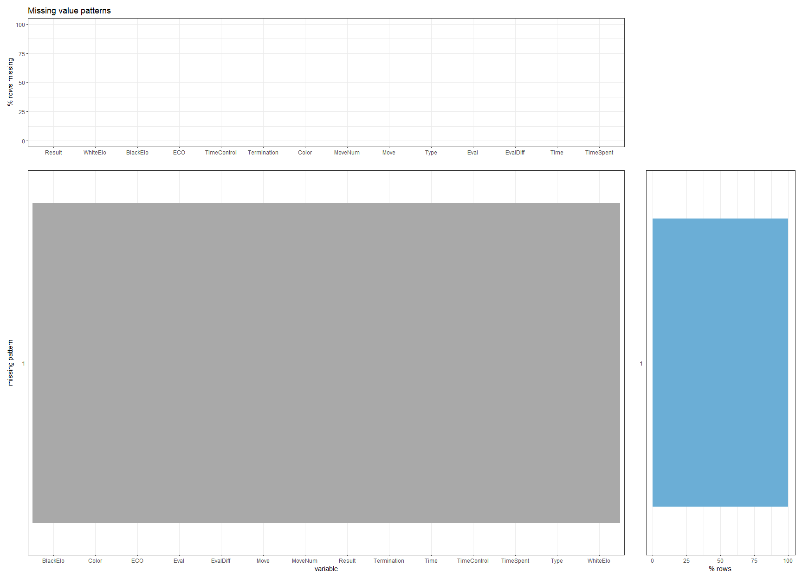
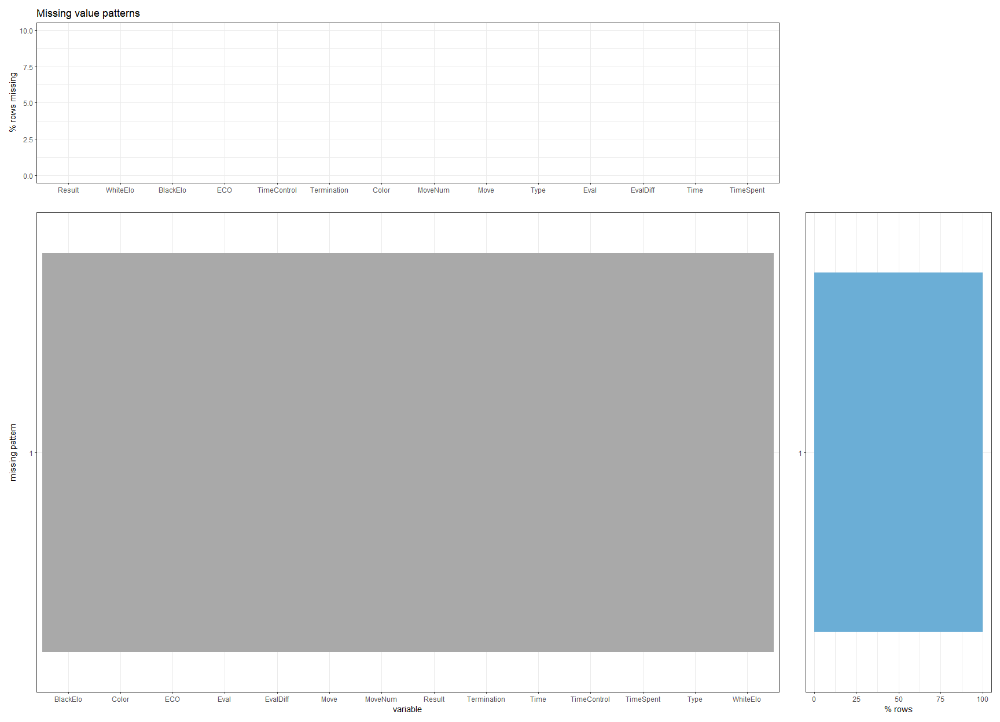

# Missing values

## Missing Values from Original Data
The following graph was generated by using the dataset data_index.csv.
The code for generating the following graphs can be accessed in [plot.R](code/plot.R) and [MissingDataMultiple.R](code/MissingDataMultiple.R).

## Missing Values of Generated Data

From reading the graph that run through one of the data set, we found that there are two columns that have missing data pattern. They were the *WhiteELOdiff* and the *BlackElodiff* Columns.
However, these two columns were not crucial in any of our analysis since the change of elo after the game and the elo system is none of our concern.
As a result, the data set itself was complete and created no hardships.

