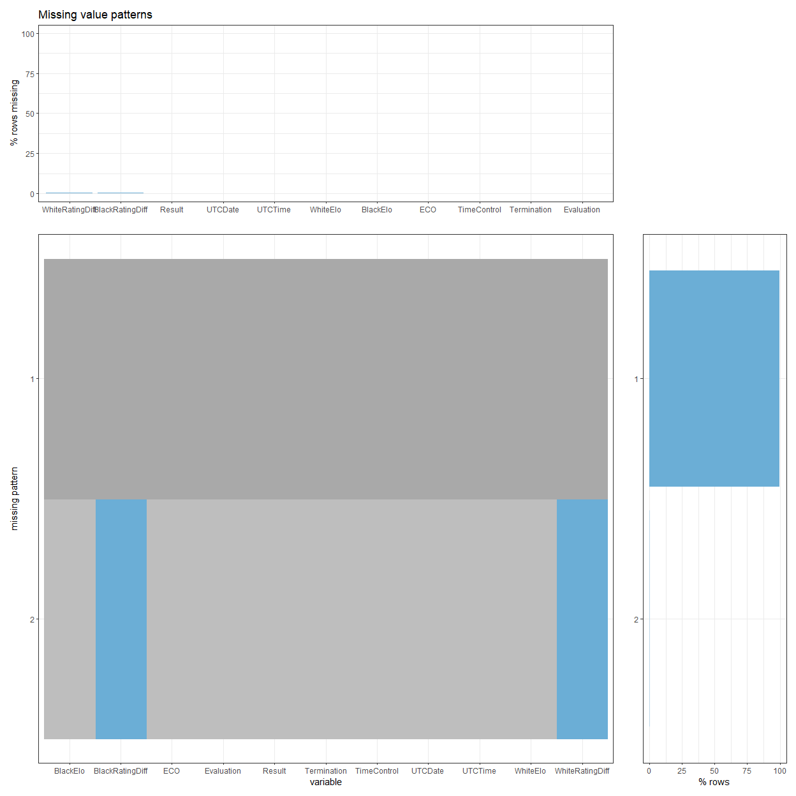

# Missing values

## missing values plot
The following graph was generated by using a sample dataset. 

## Discussion

From reading the graph that run through one of the data set, we found that there are two columns that have missing data pattern. They are the WhiteELOdiff and the BlackElodiff. 

