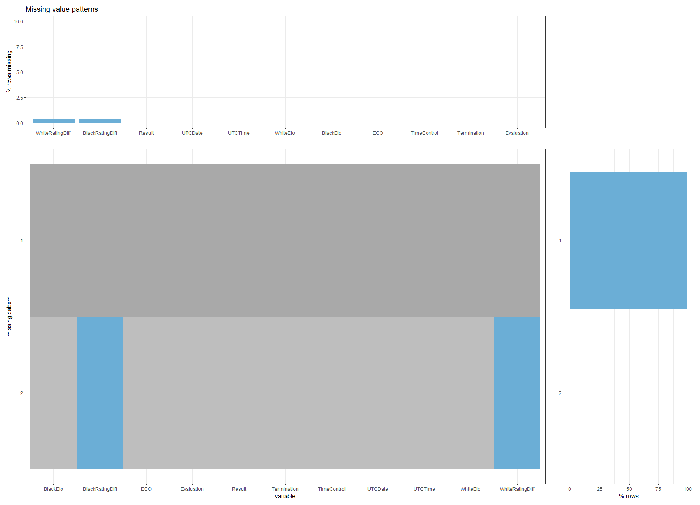

# Missing values

## Missing Values from Original Data
The following graph was generated by using the dataset data_index.csv.
The code for generating the following graphs can be accessed in [plot.R](code/plot.R) and [MissingDataMultiple.R](code/MissingDataMultiple.R).
The original data set from lichess database had missing values in **WhiteRatingDiff** and **BlackRatingDiff**.
We expected the data set to be complete but some of the game PGNs did not contain [WhiteRatingDiff "??"] or [BlackRatingDiff "??"].
We were not able to understand the reason for the flaws but they were irrelevant in our analyses

## Missing Values of Generated Data

Since the Elo system is not the focus of our analyses, the moves.csv and 600.csv included a different set of columns.
The data set for moves.csv and 600.csv were complete and created no hardships.

