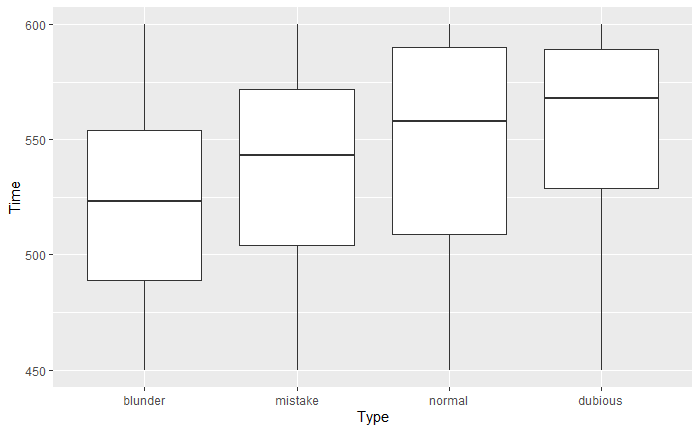
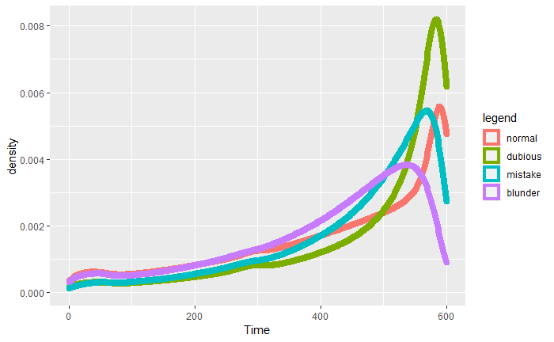
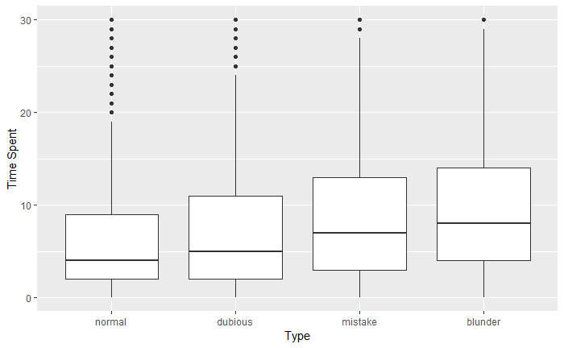
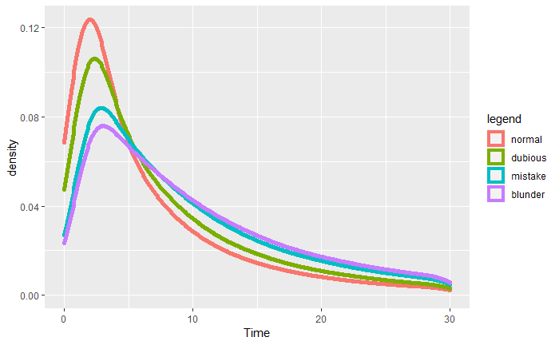
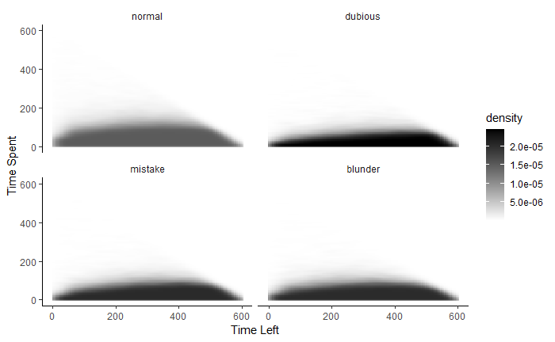
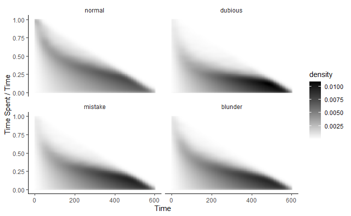

# Results

## Time and Moves

How does time and the quality of moves correlate?

We can first start by considering the simple case.

### Time Left, Spent by Move Type

The distribution of **Time Left** and **Time Spent** by the type of moves people make.





```{r}
# library(tidyverse)
# library(hrbrthemes)
# library(weights)
# d = "C:/Users/juhyu/eclipse-workspace/ChessData/600+0_"
# e = ".csv"
# This part of the code didn't run on bookdown
# The same code was ran in a different r environment
# for (i in 1:16){
#   direc = paste(d, as.character(i), e, sep = "")
#   df0 <- read.csv(direc, header = TRUE)
#   df0 <- filter(df0, Type != "Type")
#   df0 <- df0 %>% mutate(
#     Time = ifelse(Time != "0", as.numeric(hms::hms(Time)), 0L),
#     TimeSpent = ifelse(TimeSpent != "0", as.numeric(hms::hms(TimeSpent)), 0L), 
#   )
#   df0 <- filter(df0, Time <= 600 & TimeSpent <= 600)
#   if(i == 1){
#     df1 <- select(df0, Type, Time, TimeSpent)  
#   }
#   else{
#     df2 <- select(df0, Type, Time, TimeSpent)  
#     df1 <- union_all(df1, df2)
#   }
# }
# df2 <- count(df1, Type, Time, TimeSpent)

# df2 <- saved
# ggplot(df2, aes(x = fct_relevel(Type, "blunder", "mistake", "normal", "dubious"), y = Time, weight = n)) + 
#   geom_boxplot() + 
#   xlab("Type") + 
#   ylab("Time Left") +
#   ylim(450, 600)
# ggplot(data = df2, aes(x = Time, weight = n, color = fct_relevel(Type, "normal", "dubious", "mistake", "blunder"))) + 
#   geom_density(size = 3) +
#   xlab("Time") +
#   labs(color = "legend")
# 
# ggplot(df2, aes(x = fct_relevel(Type, "normal", "dubious", "mistake", "blunder"), y = TimeSpent, weight = n)) + 
#   geom_boxplot() + 
#   xlab("Type") + 
#   ylab("Time Spent") +
#   ylim(0, 30)
# 
# ggplot(data = df2, aes(x = TimeSpent, weight = n, color = fct_relevel(Type, "normal", "dubious", "mistake", "blunder"))) + 
#   geom_density(size = 2) +
#   xlab("Time") +
#   xlim(0, 30) +
#   labs(color = "legend")
#game1<-game%>%filter(Timet>=240&Timet<=360)
#game2<-game%>%filter(Timet>=0&Timet<=120)
#plot1<-ggplot(data = game1, aes(x = Timet, color = fct_relevel(Type, "normal", "dubious", "mistake", "blunder"))) + 
#   geom_density(size = 1) +
#   xlab("Time Left") +
#   labs(color = "legend")+
#  geom_vline(xintercept = 300)+
#  scale_x_continuous(breaks = seq(240, 360, by = 30))+
#  ggtitle("From 6 mins to 4 mins left")
#plot2<-ggplot(data = game2, aes(x = Timet, color = fct_relevel(Type, "normal", "dubious", "mistake", "blunder"))) + 
#   geom_density(size = 1) +
#   xlab("Time Left") +
#   labs(color = "legend")+
#  geom_vline(xintercept = 60)+
#  geom_vline(xintercept = 10)+
#  scale_x_continuous(breaks = seq(10, 120, by = 10))+
#  ggtitle("From 2 mins to 0 mins left")

```

This graph provides a very unique insight to the correlation.

For **Time Left**:

1. **Normal** moves have the biggest std as expected. 

2. People have less **Time Left** after they make a **blunder** or **mistake**

3. **Dubious** moves are mostly made in the first 40 second of the game.

    - This may imply that **dubious moves** are part of the opening.

4. When the time left reaches **5 minutes** and **1 minutes**, sudden fluctuations were found for the count of moves


   - It is believed that **10 seconds**, **1 minute** and **5 minutes** acted as a psychological catalyst that urged players to make a move      
   
   - For both fluctuations at 5mins and 1min, we can see the curves for **normal** moves peak earlier than the other type of moves and the other moves almost peaked at the same time. However, **dubious** moves happened the most when there are 5 minutes left while **mistake** moves happened the most when there is only 1 minute left.
   
   - When the time left is less than 10 seconds, the distribution of the moves changed. **Normal** moves are made the most.
   
For **Time Spent**:

1. **Normal** moves are made fast.

    - **Normal** moves may be obvious given the position

    - **Normal** moves may be automatically played during the opening.

2. **Blunder** takes more average time than any other type of move.

    - This is less obvious. We think blunders are made **fast without thought**.

3. **Mistakes** also take more time than **normal** moves.

This is a heatmap of Time Left - Time Spent per type of move.


```{r}
# ggplot(df2, aes(x = Time, y = TimeSpent)) + 
#   stat_density_2d(aes(fill = ..density..), geom = "raster", contour = FALSE) + 
#   xlab("Time Left") +
#   ylab("Time Spent") +
#   theme(panel.grid.major = element_blank(), panel.grid.minor = element_blank(),
#         panel.background = element_blank(), axis.line = element_line(colour = "black"), strip.background = element_blank()) +
#   facet_wrap(~fct_relevel(Type, "normal", "dubious", "mistake", "blunder")) + 
#   scale_fill_gradient(low = "white", high = "black")
```

It becomes evident that people play **bad** moves **early** in the game

### Time ratio by Move

Let's define **ratio = Time Spent / Time**.

This concept of **ratio** is helpful in the sense that the person could have spent more time considering the position.

For instance, given **1 second** of time left and the player makes a move in **1 second**, then there is less possibility that the player would have detected a better move.

However, given **60 second** of time left and the player makes a move in **1 second** and **blunder**, this is a bad decision and probably the player should have thought more before they made the move.

```{r}
# df2 <- mutate(df2, ratio = TimeSpent / (TimeSpent + Time))
# tb <- df2 %>%
#   group_by(Type) %>%
#   summarise(mean = mean(ratio, na.rm = TRUE), std = sd(ratio, na.rm = TRUE))
# tb <- arrange(tb, mean)
tb <- read.csv("data/tb.csv")
tb
# ggplot(df2, aes(x = Time, y = ratio, weight = n)) + 
#   stat_density_2d(aes(fill = ..density..), geom = "raster", contour = FALSE) + 
#   xlab("Time Left") + 
#   ylab("Time Spent / Time") + 
#   theme(panel.grid.major = element_blank(), panel.grid.minor = element_blank(),
#         panel.background = element_blank(), axis.line = element_line(colour = "black"), strip.background = element_blank()) +
#   facet_wrap(~fct_relevel(Type, "normal", "dubious", "mistake", "blunder")) + 
#   scale_fill_gradient(low = "white", high = "black")

```


From this graph, 

1. The mean of **normal** moves are much higher than other moves.

    - **Normal** moves are a result of higher ratio of Time Spent / Time.

2. **Dubious** moves are most likely intended or result of bad understanding early on in the game.

3. **Mistakes** and **blunders** are also a result of not enough thinking.

    - Players could have spent **much more time** thinking about the position and not blundering.
```{r}
#game<- read.csv("~/Desktop/project test/ChessData/game.csv")
#Return_Type <- function(move){
#  ifelse(grepl("K", move), "King",
#         ifelse(grepl("O-O", move), "King",
#                ifelse(grepl("Q", move), "Queen", 
#                       ifelse(grepl("N", move), "Knight", 
#                              ifelse(grepl("B", move), "Bishop", 
#                                     ifelse(grepl("R", move), "Rook", "Pawn"))))))
#}
#game<- mutate(game, 
#  Timet = as.numeric(hms(Time)),
#  TimeInt = as.numeric(hms(TimeSpent)), 
#  Move = str_remove_all(Move, '[+?]'),
#  Piece = Return_Type(Move),
#  Mate = ifelse(grepl("#", Eval), "hungMate", ifelse(EvalDiff == 0, "missedMate", "normal")),
#  MoveNumber=as.numeric(MoveNum),
#  Timeratio=TimeInt/Timet
#)
#gametemp=game
#gametemp[order(nrow(gametemp):1),]%>%distinct(Result,WhiteElo,BlackElo, .keep_all=TRUE)%>%ggplot(aes(x=MoveNumber,fill=fct_relevel(Termination,"normal","Time #forfeit"),color=fct_relevel(Termination,"normal","Time forfeit")))+geom_density(stat="count",alpha=0.5)+xlab("Move number")+
#  ggtitle(" Distribution of the game ending reasons at different number of moves")+theme(legend.title = element_blank())
#  
#gametemp=game
#gametemp[order(nrow(gametemp):1),]%>%distinct(Result,WhiteElo,BlackElo, .keep_all=TRUE)%>%
#  filter(Termination=="Time forfeit")%>%select(Termination,Timet)%>%ggplot(aes(x=Timet))+geom_density()+
#  xlab("Remaining time (seconds)")+
#  xlim(0,600)+
#  ggtitle("Distribution of remaining time when player quits")
#library(scales)
#gametemp=game
#gametemp$Timeratio<-rescale(gametemp$Timeratio, from = c(0, 1), to = c(0, 100))
#gametemp[order(nrow(gametemp):1),]%>%distinct(Result,WhiteElo,BlackElo, .keep_all=TRUE)%>%select(Termination,Timeratio,MoveNumber)%>%
#  filter(Termination=="Time forfeit")%>%ggplot(aes(x=MoveNumber,y=Timeratio,fill=Termination))+geom_point(alpha=0.1,color="blue",size=4)+ylim(0,100)+xlim(0,100)+
#  ggtitle("Time ratio vs Move Number")
```
## Investigating how the games ended
Most of the games end normally with results of either one of the players win or the match is tied. However, we see that over 10% of the games ended with someone ran out of time.


From this graph,

1. The majority of matches ended within **25** moves, however, matches that end with one player ran out of time were mostly happening at **35** moves.

2. Number of matches ended with the reason of rules infraction is neglectable.

### Time left and time ratio when the losers ran out of run


## 

## Quality of move during low time

Players have to make decisions in a short period of time 
###


