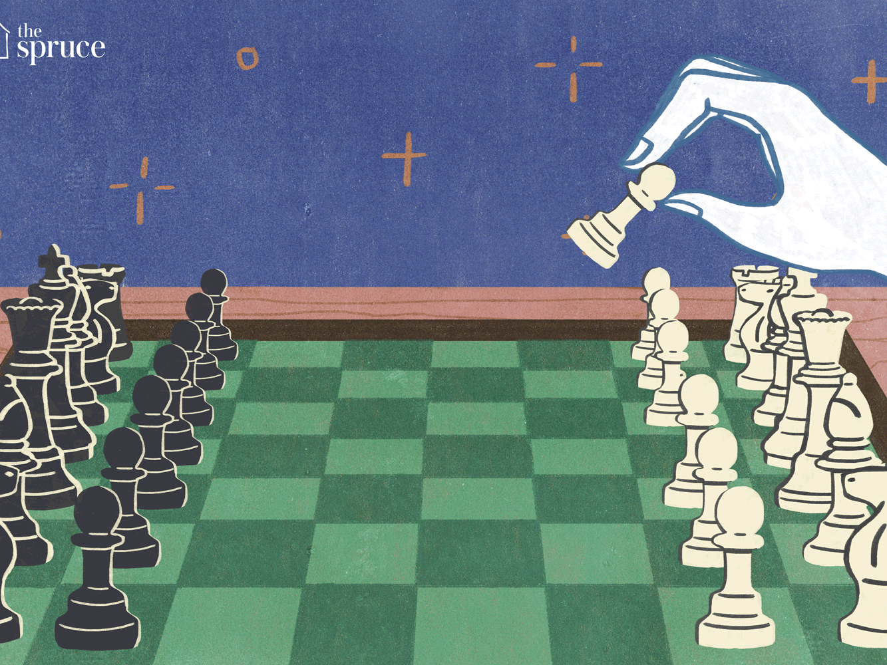

--- 
title: "Chess Game Analysis"
author: "Ju Hyun Jeon Freddy Wong"
date: "`r Sys.Date()`"
site: bookdown::bookdown_site
---

# Introduction

## Background

Chess is one of the most popular games in the world which could be dated back to the 15th century. In today's world, more than millions of people played everyday. According to a press release by AGON, 605 million adults play chess regularly, which is comparable to the number of regular users of Facebook

## Specific Library Used

### Rchess

